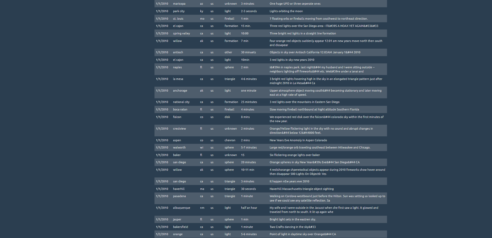
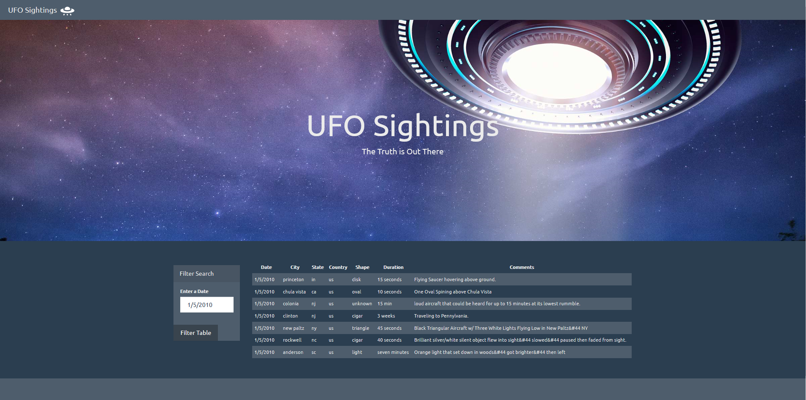

# javascript-challenge
### Level 1: Automatic Table and Date Search (Required)

* Create a basic HTML web page or use the [index.html](StarterCode/index.html) file provided (we recommend building your own custom page!).

* Using the UFO dataset provided in the form of an array of JavaScript objects, write code that appends a table to your web page and then adds new rows of data for each UFO sighting.

  * Make sure you have a column for `date/time`, `city`, `state`, `country`, `shape`, and `comment` at the very least.

* Use a date form in your HTML document and write JavaScript code that will listen for events and search through the `date/time` column to find rows that match user input.

## Screenshots of Completed Page
### Landing Page - Pre Filter

### Post Filtered Page
